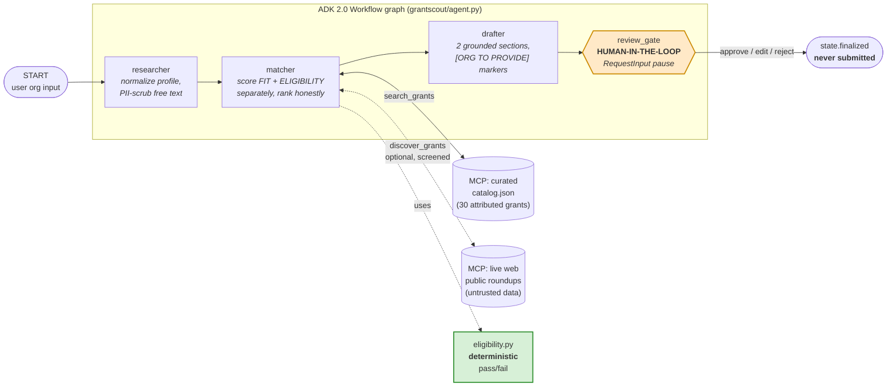
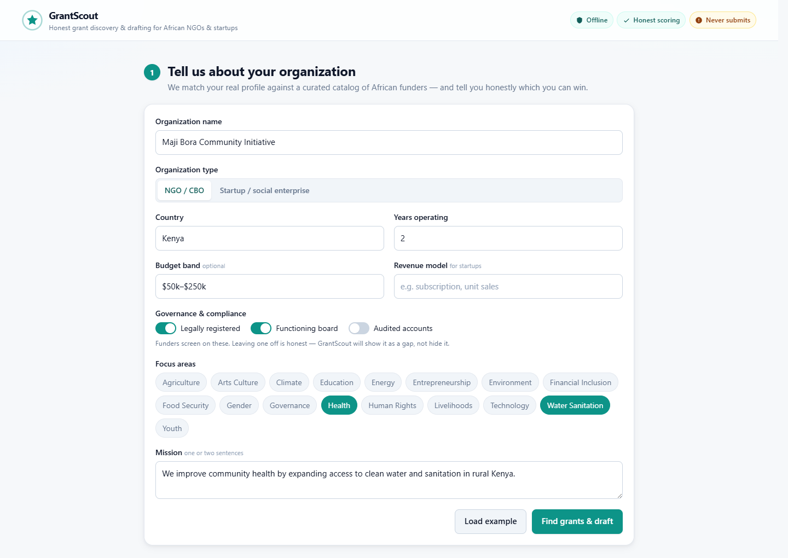
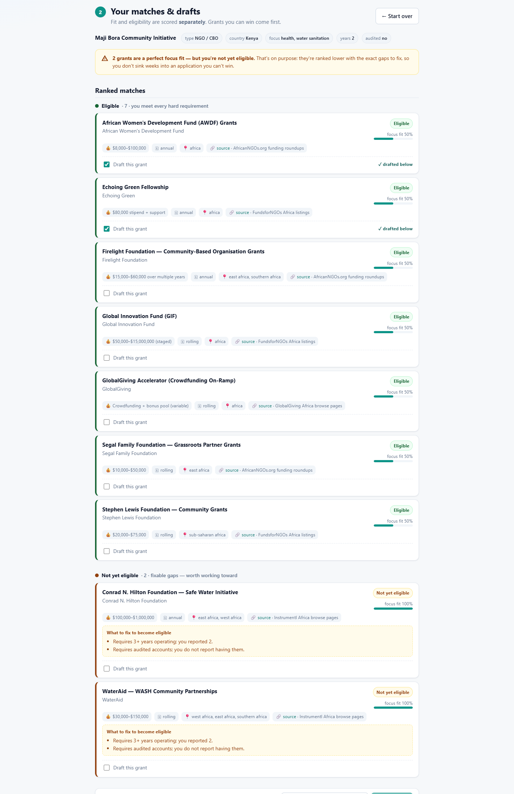
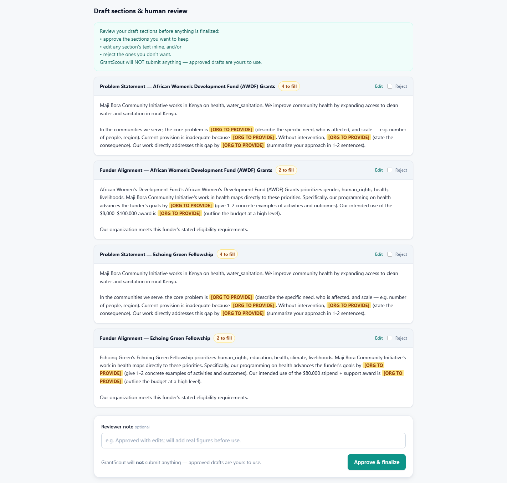
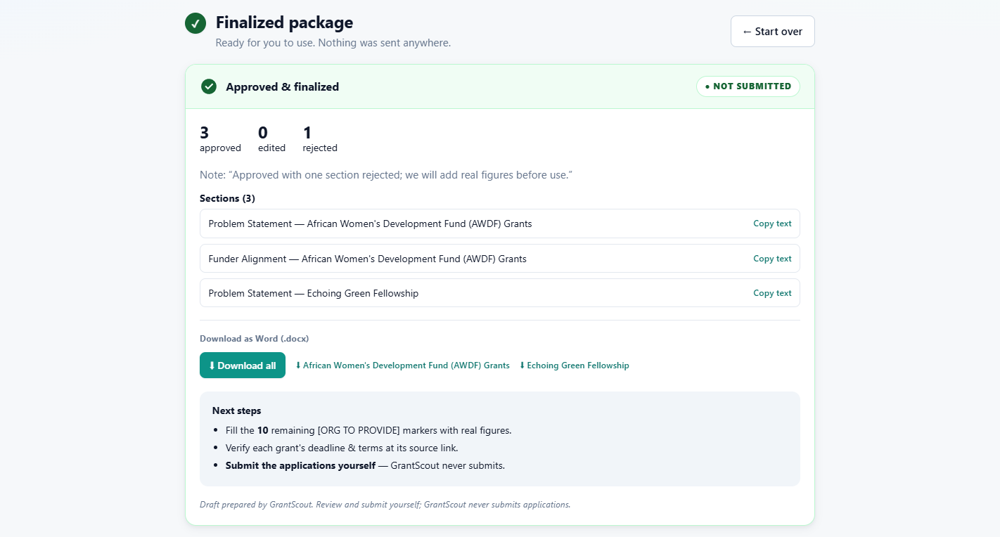
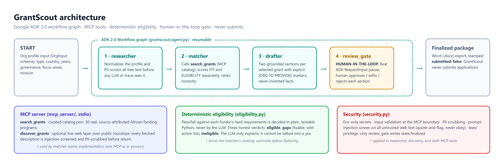

# GrantScout

**A grant-discovery-and-drafting agent for African NGOs/CBOs and startups/social
enterprises.** It profiles your organization, matches it against a curated catalog
of African funding opportunities with **honest eligibility scoring**, drafts two
high-value tailored application sections, and **pauses for human review** before
anything is finalized. It **never submits** applications — it produces drafts for a
human to use.

> Built on **Google ADK 2.0** (graph Workflow API) for the Kaggle *AI Agents:
> Intensive Vibe Coding* capstone. This repository is **Phase 1** — everything
> machine-independent (graph, MCP server, catalog, node logic, eligibility checks,
> security utilities, tests, local runner). Google-tooling steps (agents-cli, real
> keys, dry-run, deploy) are **Phase 2 (Antigravity)** and are intentionally not
> done here.

---

## The problem

There is **no single free official African-grants API** (unlike US Grants.gov).
The funding data is real and abundant but scattered across newsletters, blog
roundups, and gated platforms. Two things follow:

1. **Discovery is hard.** Finding opportunities you actually qualify for means
   trawling many sources by hand.
2. **Honesty is rare.** Tools (and hopeful humans) tend to over-state readiness.
   An NGO that spends three weeks writing a proposal it can never win has been
   *actively harmed*.

## The solution

GrantScout consolidates real opportunities from **public roundup sources** into one
queryable catalog (that consolidation **is** the contribution), then runs a 4-node
agent pipeline that scores **fit** and **eligibility separately** and **surfaces
gaps honestly** — "not yet eligible" is treated as a feature, an action list, not
a polite lie.

Both audiences (NGOs/CBOs and startups/social enterprises) run through **one
pipeline**. `org_type` is a profile *field* that drives eligibility scoring, not a
branch in the graph.

---

## Architecture



**Flow:** `START → researcher → matcher → drafter → review_gate → (finalized)`.
A straight spine, no branching. The matcher calls the MCP `search_grants` tool
(curated catalog) and optionally `discover_grants` (live web), then ranks using the
**deterministic** `eligibility.py`. The review gate is a real ADK HITL pause.

---

## Screenshots

| | |
|---|---|
|  |  |
| **1 · Profile** — honest governance switches; leaving one off becomes a visible gap, not a hidden lie. | **2 · Ranked matches** — fit and eligibility scored separately; two 100%-focus-fit funders ranked *last*, each with its exact fix list. |
|  |  |
| **3 · Human review gate** — drafted sections with highlighted `[ORG TO PROVIDE]` markers; approve / edit / reject each. | **4 · Finalized** — "3 approved, 1 rejected", stamped **NOT SUBMITTED**, Word (.docx) downloads per grant. |



---

## The two MCP tools (`mcp_server/`)

| Tool | Backing | What it does |
|------|---------|--------------|
| `search_grants(focus_areas, country, org_type, max_deadline=None)` | `catalog.json` (curated) | Filters the curated catalog. Returns grants with `eligible_org_types` + structured `eligibility_requirements` so eligibility can be scored deterministically. The reliable core. |
| `discover_grants(focus_areas, country)` | live web (`urllib`) | Best-effort fetch over public roundup pages, normalized to the `Grant` shape. **Every fetched description is screened for prompt injection and scrubbed of PII before return.** The freshness layer. Off by default in the pipeline. |

Run the server standalone (speaks MCP over stdio):

```bash
python -m mcp_server.server
```

The same search/discovery implementations (`catalog_search.py`, `discovery.py`)
back both the MCP server **and** the in-process matcher, so the contract is
identical whether called over MCP or directly.

---

## The eligibility-honesty mechanism (the most important part)

**Pass/fail is decided in plain Python (`grantscout/eligibility.py`), never by the
LLM.** Whether an org meets a funder's hard requirements (right org_type? right
country? registered? 2+ years? audited accounts? functioning board?) is a factual,
checkable question. Language models reliably *round up* — they tell a hopeful NGO
it "looks eligible" because the framing rewards optimism. That is exactly the
failure mode this project exists to avoid, so the decision lives where it is
auditable, testable, and cannot be "talked into" a yes. The LLM only **explains**
the gaps in plain language; it never overrides the verdict.

Three honest outcomes:

| status | meaning |
|--------|---------|
| `eligible` | meets every hard requirement |
| `gaps` | fails a **fixable** requirement (years / audit / board / registration) — "not yet eligible", here's the action list |
| `ineligible` | fails a **structural** requirement (wrong org_type or out of country scope) — ranked lowest, stated plainly |

And the ranker (`grantscout/matching.py`) sorts **eligible above merely-high-fit**:
a perfect-focus-fit grant the org *cannot win* is intentionally ranked **below** a
weaker-fit grant it *can* — with the reason attached. You can see this live in the
local runner output: WaterAid and the Conrad N. Hilton Safe Water Initiative come
back at **100% focus fit but ranked last**, because the sample org has only 2 years
of operation and no audited accounts.

---

## Security features (`grantscout/security.py`)

| Feature | Where | What |
|---------|-------|------|
| Secrets via env only | `.env.example`, `llm.py` | No keys hardcoded or committed; `.env` is gitignored. |
| Input validation | `validate_search_args` | Type-checks tool inputs at the MCP boundary; rejects malformed payloads with `ValueError`. |
| PII scrub | `pii_scrub` | Redacts emails, phone numbers, and embedded URL credentials before text reaches an LLM/trace. Applied in the researcher and on all discovered web text. |
| Prompt-injection screen | `injection_screen` / `neutralize` | Screens untrusted web descriptions for adversarial instructions; **quote-and-flag, never obey.** Flagged text is wrapped as inert `UNTRUSTED_DATA`. |
| Least privilege | graph design | Each node calls only the tools it needs; **only `review_gate` writes `state.finalized`.** |
| No submission | `review_gate.py` | The agent never submits anywhere; the finalized package is stamped `submitted: false`. |

---

## Course concepts demonstrated → where they live

| Concept | Where in code |
|---------|---------------|
| **ADK multi-agent (workflow graph)** | `grantscout/agent.py` — `Workflow` with `researcher → matcher → drafter → review_gate` |
| **MCP server** | `mcp_server/server.py` exposes `search_grants` (catalog) + `discover_grants` (live web) |
| **Human-in-the-loop** | `grantscout/nodes/review_gate.py` — `RequestInput` pause + `rerun_on_resume=True` finalize |
| **Security features** | `grantscout/security.py` — validation + PII scrub + injection screen; env-var secrets; least privilege |
| **Eligibility honesty** | `grantscout/eligibility.py` (deterministic verdict) + `grantscout/matching.py` (honest ranking) |
| Deployability / Antigravity | **Phase 2** (see handoff) |

---

## Local setup & run (no cloud, no API key)

Requires Python 3.11 and [`uv`](https://docs.astral.sh/uv/).

```bash
# 1. create the environment and install deps
uv venv --python 3.11
uv pip install -e ".[dev,web]"   # core + pytest + web UI; add "llm" for the optional LLM path

# 2. run the tests (all green, hermetic — no network, no key)
uv run pytest -q

# 3a. run one full pipeline turn in the terminal (includes the human-review pause)
uv run python run_local.py

# 3b. …or use the interactive web UI (recommended)
uv run python run_web.py         # then open http://127.0.0.1:8000
```

### Two ways to interact

- **Web UI (`run_web.py`)** — a polished single-page interface: fill in your org
  profile (or click *Load example*), see ranked matches grouped by eligibility
  with fit meters and honest gap lists, **tick which grants to draft** (re-draft on
  demand), review/edit/reject the drafted sections at the human-review gate, get a
  finalized package clearly stamped **NOT SUBMITTED**, and **download the drafts as
  Word (.docx)** (all together or one file per grant, with the `[ORG TO PROVIDE]`
  markers highlighted so non-technical users see exactly what to fill). It's a thin
  Starlette app (`web/`) that drives the *same* ADK graph offline; grant selection
  flows through the graph as an input, and the review gate is a real HITL
  pause/resume.
- **CLI (`run_local.py`)** — the same pipeline as a scripted terminal run with a
  color, aligned, grouped output (set `GRANTSCOUT_FORCE_COLOR=1` to keep color when
  piping). Good for demos and CI.

With **no API key set**, the three reasoning nodes use their deterministic
fallbacks, so the catalog + eligibility + review-gate spine runs end-to-end
locally. Set `GOOGLE_API_KEY` (see `.env.example`) to light up the LLM prose path
— that real connectivity is a **Phase 2** step.

To also pull live web results into the matcher (network required):

```bash
GRANTSCOUT_ENABLE_DISCOVERY=1 uv run python run_local.py
```

---

## Phase 2 (Antigravity) handoff

Phase 1 deliberately stops at the Google-tooling boundary. Phase 2 will:

- `uvx google-agents-cli setup` + `agents-cli info` (confirm ADK 2.0 skills).
- Reconcile structure with `agents-cli scaffold` conventions (minimal touch).
- Create a **real** `.env` from `.env.example` (AI Studio key or gcloud ADC).
- `agents-cli deploy --dry-run` → clean (`uv.lock` is already present).
- Deploy to Agent Runtime; verify Cloud Trace; capture the eligibility-honesty
  moment and the review gate for the video.

The ground truth Phase 2 verifies against is in
[`PHASE1_HANDOFF.md`](PHASE1_HANDOFF.md), read alongside `grantscout.spec.yaml`.

Every Phase-2-only spot in the code is marked with a `# PHASE 2 (Antigravity):`
comment.

---

## Repository layout

```
grantscout/
  agent.py            # ADK 2.0 Workflow graph (root_agent, app)
  config.py           # model name, thresholds, vocabularies (no secrets)
  models.py           # Pydantic models (Grant, OrgProfile, Match, ReviewDecision, ...)
  eligibility.py      # DETERMINISTIC eligibility checks (the honesty mechanism)
  matching.py         # fit scoring + honest ranking (pure, no ADK import)
  security.py         # pii_scrub, injection_screen, validators
  llm.py              # thin Gemini wrapper; no key -> deterministic fallback
  ui.py               # terminal presentation layer for the CLI (color/alignment)
  nodes/
    researcher.py     # build/normalize profile, PII-scrub
    matcher.py        # call search_grants, score + rank, surface gaps
    drafter.py        # 2 grounded sections with [ORG TO PROVIDE] markers
    review_gate.py    # HITL RequestInput pause; only writer of state.finalized
mcp_server/
  server.py           # FastMCP: search_grants + discover_grants (stdio)
  catalog.json        # 30 curated African grants, attributed to public sources
  catalog_search.py   # shared catalog filter (backs both MCP + matcher)
  discovery.py        # live web discovery + injection screening
web/
  server.py           # Starlette app: /api/run + /api/finalize + /api/export
  docx_export.py      # builds the Word (.docx) download (python-docx)
  static/             # index.html + styles.css + app.js (polished single-page UI)
tests/                # pytest: eligibility, matching, security, catalog, discovery, review-gate
run_local.py          # one full offline pipeline turn incl. the gate pause (CLI)
run_web.py            # launches the local web UI
.env.example          # placeholder keys ONLY
```

## Data & attribution

The catalog consolidates **real** funder programs that appear across public
roundups (AfricanNGOs.org, FundsforNGOs, GlobalGiving/Instrumentl, Africa-Grants.com).
Each entry carries a `source` attribution and the funder's `url`. **Verify the exact
current deadline and terms at the source before applying.** No grants are invented.
This is a discovery aid over public data, not a scrape of a paywalled product.
